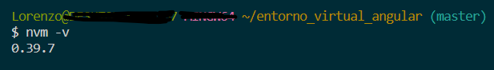
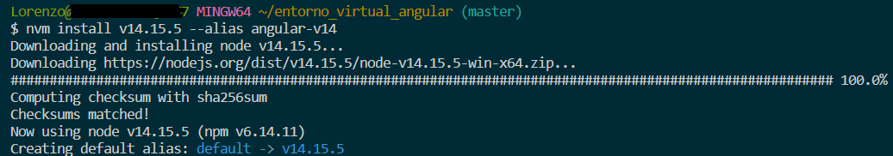
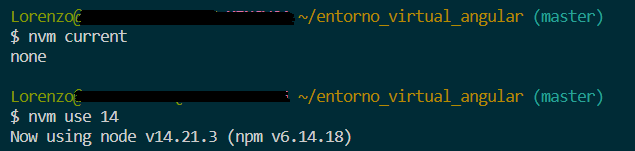
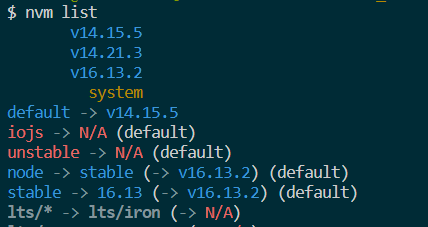

## Paso 1: Instalar nvm (Node Version Manager)

1. Descarga nvm desde GitHub: [https://github.com/nvm-sh/nvm](https://github.com/nvm-sh/nvm)

```powershell
curl -o- https://raw.githubusercontent.com/nvm-sh/nvm/v0.39.7/install.sh | bash
```


2. Sigue las instrucciones del GitHub.

3. Verifica que la instalación se haya realizado.

```powershell
nvm -v
```


## Paso 2: Creación de entorno

Comando para instalar otra versión de Node:

```powershell
nvm install v14.15.5 --alias angular-v14

// Diferente versión
nvm install v16.13.2 --alias angular-v1
```

(Se pueden instalar todas las versiones disponibles)

Activa el entorno virtual recién creado:

```powershell
nvm use angular-v14
```


## Paso 3

Instalar la versión de Angular deseada:

```powershell
npm install -g @angular/cli@14
```

(Esta versión puede variar, al igual que la de Node. El siguiente paso sería crear un proyecto)

## Otros comandos de nvm

Comprobar qué versión se está ejecutando:

```powershell
node -v
```

Listar todas las versiones descargadas de manera virtual:

```powershell
nvm list
```


Para más información, accede al repositorio oficial.
